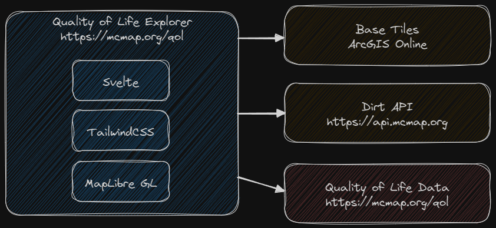

# Quality of Life Explorer

The Quality of Life project is a joint venture from Mecklenburg County, the City of Charlotte, and UNCC. It's built with [Svelte](https://svelte.dev/), [TailwindCSS](https://tailwindcss.com/), and [Maplibre GL JS](https://maplibre.org/maplibre-gl-js/docs/). The development and build environment is [Vite](https://vitejs.dev/). 

Site: [https://mcmap.org/qol](https://mcmap.org/qol)

## Architecture



The Quality of Life Explorer includes the main site (`index.html`), an embed page (`embed.html`), and a report (`report.html`). All pages share the same collection of Svelte components.

See the `data/README.md` file for information on the data format.

The base vector tiles are set a `.env` file in the root of the project using the `VITE_MAPTILES` environmental variable, which should point to a Mapbox Vector Tile spec JSON document. Ex:

```env
VITE_MAPTILES="https://server.com/your-style.json"
```


## Using the project

[Node.js](https://nodejs.org/en) is required to run the development and build systems, and [git](https://git-scm.com/) is required to use the versioning system.

### Clone the project
```bash
git clone https://github.com/tobinbradley/quality-of-life-explorer
```

### Install dependencies
```bash
cd quality-of-life-explorer
npm install
```

### Start the development server
```bash
npm run dev
```

Navigate a web browser to [http://localhost:3000](http://localhost:3000) to view the HMR live development server.

### Build for production
```bash
npm run build
```

After the build is complete, copy the contents of the `dist` folder to the production web server.
